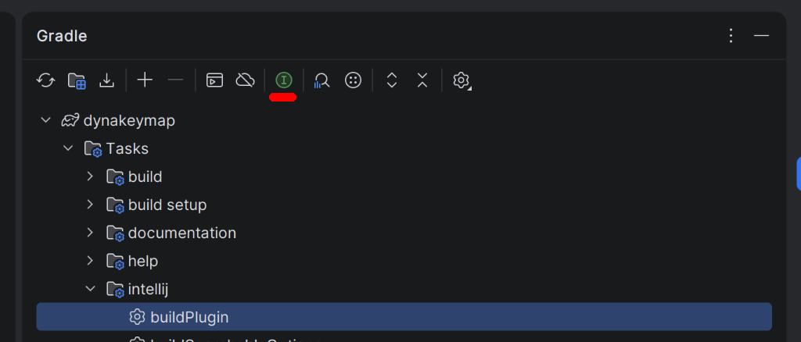
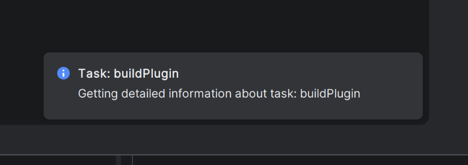
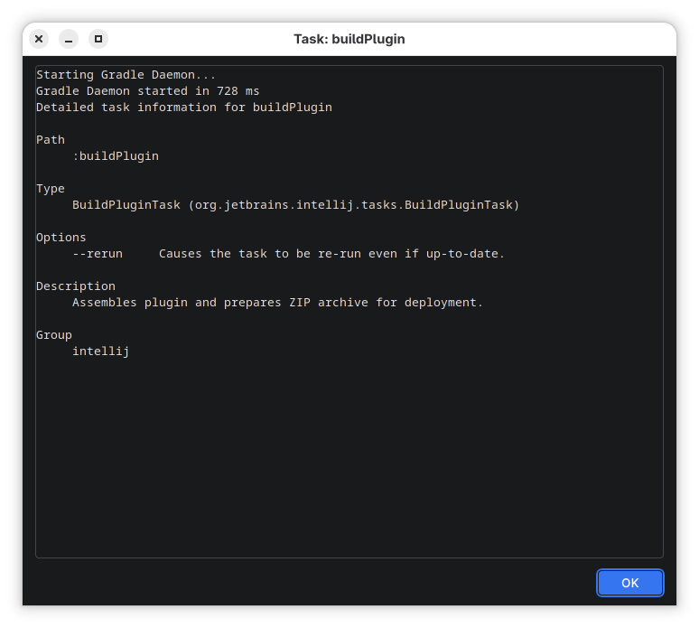

# Gradle Extras

This plugin provides useful functionality related to Gradle.

# Feature

- Adds action to show detailed help related to the selected Gradle task in Gradle toolwindow.

  - Action

  - Notification

  - Task Details

